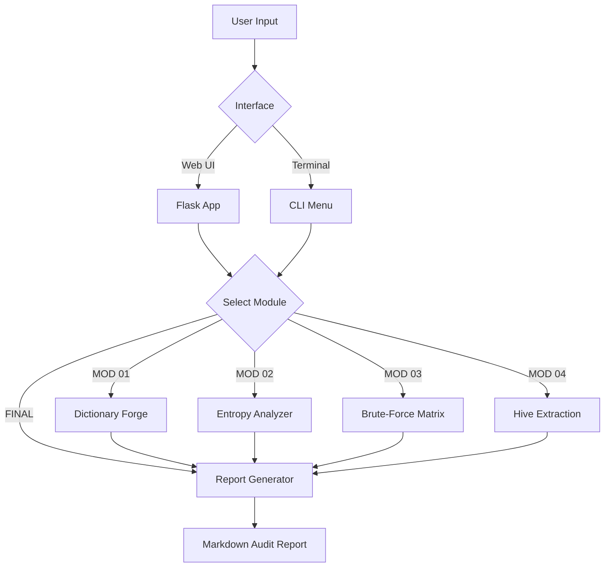

# 🔐 Qylatrix Password Cracking & Credential Audit Suite

[](https://python.org)
[](https://flask.palletsprojects.com)
[](LICENSE)
[](DISCLAIMER)

> **Qylatrix Offensive Security Suite** — A premium, professional-grade toolkit for password policy testing, entropy analysis, and credential security assessment. Built for ethical, educational security research.

---

## ✨ Features

| Module | Description |
|--------|-------------|
| 📖 **Dictionary Forge** | Generate intelligent wordlists with L33tspeak, CamelCase & suffix mutation |
| 🔬 **Entropy Analyzer** | Shannon entropy, zxcvbn scoring, time-to-crack estimation |
| ⚡ **Brute-Force Matrix** | Model computational attack surface against ASIC hardware |
| 🛡️ **Hive Extraction** | Simulate Linux `/etc/shadow` & Windows SAM dump parsing |
| 📊 **Audit Report Generator** | Generate comprehensive Markdown security audit briefs |

---

## 🚀 Quick Start

### Prerequisites
- Python 3.10 or higher
- pip

### Installation

```bash
# Clone the repository
git clone https://github.com/Qylatrix/qylatrix-offensive-suite.git
cd qylatrix-offensive-suite

# Create a virtual environment (recommended)
python -m venv venv
source venv/bin/activate     # On Windows: venv\Scripts\activate

# Install dependencies
pip install -r requirements.txt
```

### Running the Web App

```bash
python webapp.py
```

Navigate to **http://127.0.0.1:5000** — the premium UI will be live.

### Running the CLI

```bash
python main.py --interactive
```

---

## 🗂️ Project Architecture

```
qylatrix-offensive-suite/
├── webapp.py               # Flask web application entry point
├── main.py                 # CLI interactive menu entry point
├── requirements.txt        # Python dependencies
├── modules/
│   ├── dictionary_gen.py   # Wordlist generation with mutations
│   ├── strength_analyzer.py# Password entropy & zxcvbn analysis
│   ├── brute_force_sim.py  # Time-to-crack estimation simulator
│   ├── hash_extractor_sim.py # Shadow/SAM hash parsing simulation
│   └── report_generator.py # Markdown audit report generation
├── templates/
│   └── index.html          # Premium animated Flask UI
└── static/                 # Static assets
```



---

## 🛠️ Module Details

### 1. Dictionary Forge
Generates custom wordlists from a list of base words by applying:
- Leet-speak substitutions (`a→@`, `e→3`, `s→$` etc.)
- CamelCase and UPPERCASE variants
- Digit suffixes and year appends (e.g., `alice2024`, `Alice!`)

### 2. Entropy Analyzer
Uses [`zxcvbn`](https://github.com/dwolfhub/zxcvbn-python) for realistic password strength estimation including:
- Shannon entropy (bits)
- Pattern matching (keyboard walks, dates, common names)
- Time-to-crack display for multiple attack scenarios
- Actionable remediation recommendations

### 3. Brute-Force Matrix
Models theoretical brute-force attacks by:
- Calculating keyspace size based on character set
- Assuming GPU/ASIC hash rate benchmarks per algorithm (MD5, SHA-256, NTLM, bcrypt)
- Formatting human-readable time-to-crack estimates

### 4. Hive Extraction (Simulated)
Demonstrates how credential hashes are extracted from:
- **Linux** `/etc/shadow` — SHA-512 and MD5-crypt entries
- **Windows** SAM database — NTLM hash format

> ⚠️ This is a **simulation only** — no actual system files are read.

### 5. Audit Report Generator
Runs a full policy audit on a supplied list of passwords and outputs:
- Per-password scoring and entropy breakdown
- Organization-level security posture summary
- Remediation recommendations in Markdown format

---

## ⚖️ Disclaimer

**This tool is intended for educational and ethical security assessment purposes only.**  
Use it exclusively on systems you own or have explicit written permission to test.  
The authors are not responsible for any misuse. See [LICENSE](LICENSE).

---

## 🤝 Contributing

Contributions are welcome! Please read [CONTRIBUTING.md](CONTRIBUTING.md) first.

---

## 📜 License

MIT — See [LICENSE](LICENSE) for details.

---

<div align="center">
<strong>© 2026 Qylatrix Industries — The Syntax of Safety</strong>
</div>
